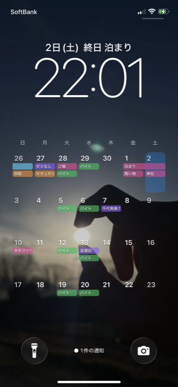

# lifelify

日記、予定、ToDo、習慣、ヘルス記録、記念日をひとつにまとめる iOS 向けライフログアプリです。

毎日の予定確認、ちょっとしたメモ、タスク管理、習慣の積み上げ、歩数や睡眠の振り返り、日記と写真の記録までを、落ち着いたカードレイアウトでまとめて扱えます。

<p align="center">
  <a href="https://apps.apple.com/jp/app/lifelog-%E6%97%A5%E8%A8%98-%E4%BA%88%E5%AE%9A-todo-%E7%BF%92%E6%85%A3-%E5%81%A5%E5%BA%B7-%E3%83%A1%E3%83%A2/id6755782099">
    
  </a>
</p>

## Milestone

130ダウンロード & 10レビューいただきました！皆さん本当にありがとうございます！このまま高評価を維持できるように頑張ります！

<p align="center">
  
  
  
  
  
  
  
  
</p>

## Recent Update

ロック画面からもカレンダーを確認できる機能を追加しました。予定やタスクを壁紙カレンダーとして表示できるので、アプリを開かなくても直近の予定をすぐに見られます。

<p align="center">
  
</p>

## Features

| 機能 | できること |
| --- | --- |
| Today | 今日の予定、タスク、メモ、習慣、ヘルスサマリー、日記を一画面で確認 |
| カレンダー | 週ビューと月ビューで予定・タスクを整理。iCloud カレンダーの予定も表示 |
| ToDo | 期限、優先度、完了状態つきでタスクを管理 |
| 日記 | テキスト、写真、気分、体調、訪れた場所、タグを記録 |
| 習慣トラッカー | 毎日、平日、曜日指定などの習慣を草ヒートマップで可視化 |
| 記念日 | 誕生日、イベント、記念日をカウントダウンまたは経過日数で表示 |
| ヘルス | 歩数、睡眠、消費カロリーなどをカードとグラフで振り返り |
| ウィジェット | ホーム画面やロック画面で予定、タスク、習慣、記念日、メモを確認 |
| ロック画面カレンダー | 予定やタスクを壁紙カレンダーとして表示し、ロック画面から確認 |
| プライバシー | アプリロック、日記・メモ本文の非表示、ローカル中心のデータ管理 |

## Concept

「毎日の予定も、ちょっとしたタスクも、習慣も、体調も、日記も。すべてをひとつのアプリで管理したい人」のための、オールインワンなライフログアプリです。

バレットジャーナルの考え方をベースにしつつ、iPhone で続けやすいように入力導線を短くし、振り返りはカレンダー、写真、グラフ、ヒートマップで自然に見返せるようにしています。

## Tech Stack

| Area | Stack |
| --- | --- |
| App | SwiftUI, SwiftData, MVVM |
| Apple integrations | HealthKit, EventKit, WidgetKit, App Intents |
| Data & backend | Local persistence, Firebase Cloud Functions, Cloud Firestore / Storage rules |
| Privacy | App Lock, E2EE for shared letters, privacy-first App Store configuration |

## Code Status

| Metric | Value |
| --- | ---: |
| 総行数 | 72,798 |
| 最大ファイル | `lifelog/Views/Journal/JournalView.swift` / 3,873 行 |

集計対象: `git ls-files` で追跡されているリポジトリ内ファイル。依存関係フォルダなど未追跡ファイルは含みません。

## Repository

```
lifelog/
├── lifelog/                    # メインアプリ
│   ├── Models/                 # データモデル
│   ├── Views/                  # SwiftUI ビュー
│   ├── ViewModels/             # 画面状態とユースケース
│   ├── Services/               # 永続化、通知、連携、分析、暗号化
│   └── Components/             # 共通 UI
├── LifelogWidgets/             # iOS ウィジェット
├── functions/                  # Firebase Cloud Functions
├── docs/                       # 要件、UIガイド、機能仕様
├── public/                     # サポートページなどの公開静的ファイル
└── lifelog.xcodeproj
```

## Documentation

| 内容 | ファイル |
| --- | --- |
| 要件定義・機能一覧 | [`docs/requirements.md`](docs/requirements.md) |
| UI / 操作ガイドライン | [`docs/ui-guidelines.md`](docs/ui-guidelines.md) |
| コントリビューターガイド | [`AGENTS.md`](AGENTS.md) |
| 変更履歴 | [`docs/CHANGELOG.md`](docs/CHANGELOG.md) |

仕様変更時は `docs/requirements.md` と `docs/ui-guidelines.md` を更新し、関連する View / ViewModel のコメントにある参照も確認してください。

## Build

```sh
xcodebuild -project lifelog.xcodeproj -scheme lifelog -destination 'generic/platform=iOS' CODE_SIGNING_ALLOWED=NO
```

## Test

```sh
xcodebuild test -project lifelog.xcodeproj -scheme lifelog -destination 'platform=iOS Simulator,name=iPhone 16' CODE_SIGNING_ALLOWED=NO
```

シミュレータが利用できない環境では CoreSimulatorService まわりで失敗することがあります。その場合はローカルの Xcode または実機環境で確認してください。

## License

MIT License. See [`LICENSE`](LICENSE).


#### Directory LOC

<!-- dir-loc-start -->
| Directory | LOC |
|:--|--:|
| `lifelog` | 54,613 |
| `functions` | 10,189 |
| `docs` | 2,657 |
| `LifelogWidgets` | 2,305 |
| `assets` | 1,714 |
| `lifelog.xcodeproj` | 933 |
| `(root)` | 449 |
| `public` | 163 |
| `.github` | 132 |
<!-- dir-loc-end -->
